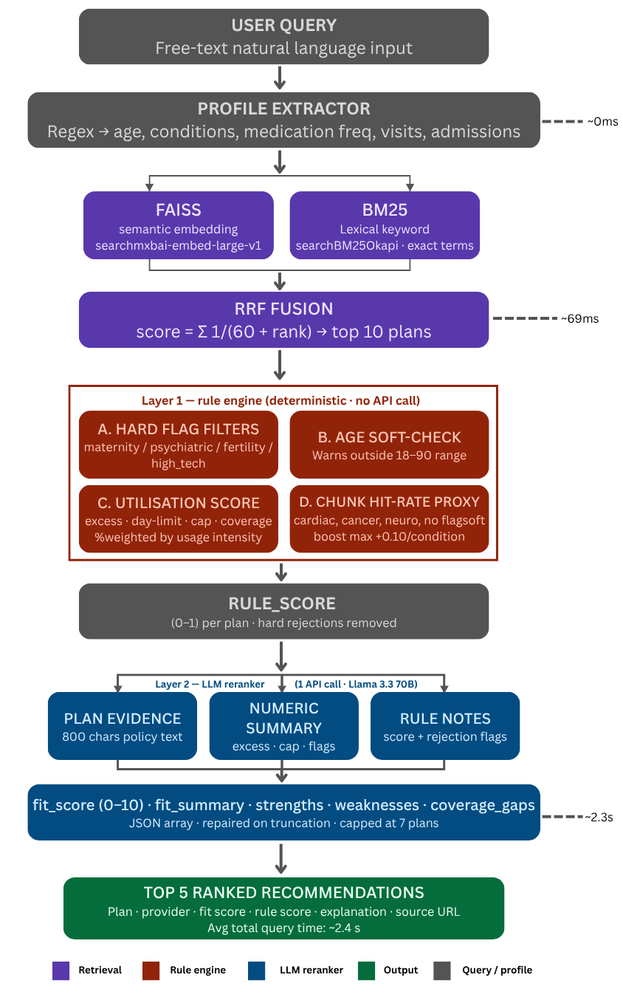
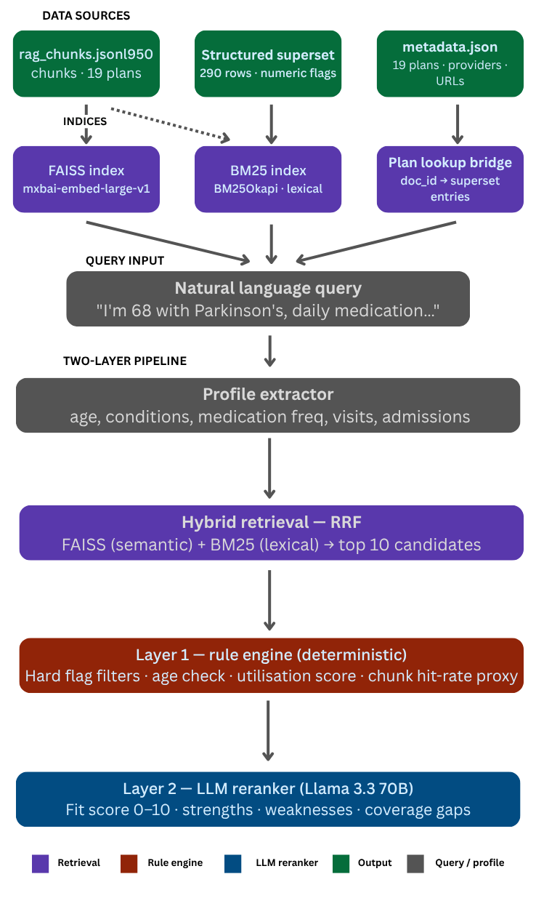

# Hybrid Risk-Aware Health Insurance Recommendation System

A hybrid retrieval and ranking system for matching Irish health insurance plans to individual user needs. Combines semantic search, lexical search, a deterministic rule engine, and an LLM reranker into a single pipeline that produces ranked plan recommendations with plain-English explanations.

[](./LICENSE)

This project is licensed under the Apache License 2.0.
---

## What it does

Given a natural language query like:

> *"I'm 68 with Parkinson's. I see a neurologist monthly and take daily medication."*

The engine returns the top 5 most suitable health insurance plans, each with:

- A **fit score** (0–10) from the LLM
- A **rule score** (0–1) from the deterministic engine
- Plain-English **strengths**, **weaknesses**, and **coverage gaps**
- A direct **source URL** to the plan document

---

## Data

| File | Description | Size |
|------|-------------|------|
| `rag_chunks.jsonl` | Chunked policy text from all plan documents | 950 chunks across 19 plans |
| `MASTER_STRUCTURED_SUPERSET_2026-1.jsonl` | Structured numeric and boolean fields per plan | 290 rows |
| `metadata (1).json` | Human plan names, providers, and source URLs | 19 entries |

### Providers covered

| Provider | Plans |
|----------|-------|
| Irish Life Health | First Cover, BeneFit, Horizon 4, Health Plan 26.1, Select Starter, Health Plans Membership Handbook, Tailored Health Plans Membership Handbook |
| Laya Healthcare | Inspire, Prime Plan, First & Family Plan, PMI Plan B |
| Level Health | Plan A, Plan B (€150 Excess), Plan B (€300 Excess), Plan C, Plan D |
| Vhi | Company Plan Plus Level 1, Health Access, Hospital Plans Rules |

### Structured superset fields

```
excess_amount        copayment_amount     coverage_percentage
limit_amount         day_limit            limit_scope
maternity_flag       psychiatric_flag     fertility_flag
high_tech_flag       international_flag
```

---
## Workflow

<p align="center">
  
</p>

## Architecture

The pipeline has two sequential layers. The rule engine runs first — fast, deterministic, no API calls. The LLM only sees plans that passed the rule engine.

<p align="center">
  
</p>


```
User query (natural language)
        │
        ▼
┌─────────────────────┐
│  Profile extractor  │  age, conditions, medication freq,
│                     │  specialist visits, hospital admissions
└────────┬────────────┘
         │
         ▼
┌─────────────────────────────────────────────────┐
│  Hybrid retrieval — RRF (top 10 candidates)     │
│                                                 │
│  FAISS (semantic)  +  BM25 (lexical)            │
│  mxbai-embed-large-v1  •  BM25Okapi             │
│  Reciprocal Rank Fusion merges both lists       │
└────────┬────────────────────────────────────────┘
         │
         ▼
┌─────────────────────────────────────────────────┐
│  LAYER 1 — Rule engine                          │
│                                                 │
│  A. Hard flag filters   → hard-reject ineligible│
│  B. Age soft-check      → warn if outside 18-90 │
│  C. Utilisation score   → numeric field scoring │
│  D. Chunk hit-rate      → proxy for unflagged   │
│                           conditions            │
│                                                 │
│  Output: rule_score (0–1) per surviving plan    │
└────────┬────────────────────────────────────────┘
         │  survivors only (typically 7–10)
         ▼
┌─────────────────────────────────────────────────┐
│  LAYER 2 — LLM reranker  (1 API call)           │
│                                                 │
│  Reads: plan evidence text + numeric summary    │
│         + user profile + rule engine notes      │
│                                                 │
│  Reasons about: unknown conditions, age impact, │
│  utilisation tradeoffs, plan text nuance        │
│                                                 │
│  Output: fit_score (0–10) + explanation         │
└────────┬────────────────────────────────────────┘
         │
         ▼
  Top 5 ranked results with full explanation
```

---

## Setup

### Requirements

```bash
pip install faiss-cpu sentence-transformers rank-bm25 openai numpy
```

### LLM provider

The engine uses any OpenAI-compatible API. The default is **Groq** — free, no credit card required.

**1. Get a free Groq key**

Sign up at [console.groq.com](https://console.groq.com) → API Keys → Create key.

**2. Set the environment variable**

```bash
export GROQ_API_KEY="gsk_your_key_here"
```

**3. Run**

```bash
python smart_rag_with_rules.py
```

### Alternative LLM providers

All providers use the same OpenAI-compatible interface — only `Section 0` of the file changes.

| Provider | Cost | Speed | Quality | Setup |
|----------|------|-------|---------|-------|
| **Groq** (default) | Free tier | Very fast | Llama 3.3 70B — excellent | `GROQ_API_KEY` env var |
| **Ollama** | Completely free | Medium (CPU-dependent) | Good | Install [ollama.com](https://ollama.com), run `ollama pull llama3` |
| **Google Gemini** | Free tier (15 req/min) | Fast | Very good | `GEMINI_API_KEY` env var + `pip install google-generativeai` |
| **HuggingFace** | Free tier | Slow | Variable | `HF_TOKEN` env var |

**Switch to Ollama** (fully offline, no internet after model download):

```python
# In Section 0 of smart_rag_with_rules.py
LLM_CLIENT = OpenAI(api_key="ollama", base_url="http://localhost:11434/v1")
LLM_MODEL  = "llama3"
```

---

## How each layer works

### Profile extractor

Parses the user's free-text query into a structured profile using regex. The LLM handles anything the parser misses.

```
"I'm 68 with Parkinson's. I see a neurologist monthly and take daily medication."
                                    │
                                    ▼
{
  "age": 68,
  "conditions": ["neurological"],
  "flagged_conditions": [],          ← neurological has no superset flag
  "medication_freq": "daily",
  "specialist_visits": None,
  "hospital_admissions": None
}
```

**Recognised conditions:**

| Condition | Superset flag | RAG coverage |
|-----------|--------------|--------------|
| Maternity / pregnancy | `maternity_flag` | 163 chunks |
| Psychiatric / mental health | `psychiatric_flag` | 166 chunks |
| Fertility / IVF | `fertility_flag` | 79 chunks |
| High-tech drugs / biologics | `high_tech_flag` | 43 chunks |
| Cardiac / heart disease | None | 73 chunks (proxy) |
| Cancer / oncology | None | 113 chunks (proxy) |
| Neurological / Parkinson's | None | 0 chunks (LLM infers) |
| Diabetes | None | 0 chunks (LLM infers) |
| Orthopaedic | None | 34 chunks (proxy) |
| Respiratory / asthma | None | 8 chunks (proxy) |
| Physiotherapy | None | 79 chunks (proxy) |
| Renal / kidney | None | 8 chunks (proxy) |

---

### Hybrid retrieval (RRF)

Runs two searches in parallel and merges them using Reciprocal Rank Fusion.

**FAISS** (semantic search) — uses `mixedbread-ai/mxbai-embed-large-v1` to embed both the query and all 950 chunks. Finds plans whose meaning matches the query even without exact word overlap.

**BM25** (lexical search) — keyword-based scoring using `BM25Okapi`. Finds plans that contain the exact words from the query. Complements FAISS for specific medical terms.

**RRF formula:**

```
score(chunk) = Σ  1 / (60 + rank_in_list)
               both lists
```

Chunks appearing in both lists get a double boost. Results are grouped by plan — the top 10 plans by best-chunk RRF score become candidates.

---

### Rule engine (Layer 1)

Runs entirely on structured data — no LLM, no API call. Produces a `rule_score` between 0 and 1, and hard-rejects plans that cannot serve the user.

#### A. Hard flag filters

If the user needs a flagged condition and the plan's flag is `False`, the plan is **eliminated immediately** — the LLM never sees it.

```python
# Example: user needs maternity cover
if "maternity" in profile["conditions"]:
    if not any(e.get("maternity_flag") for e in plan_entries):
        return 0.0, passes=False   # hard reject
```

Currently all 19 plans have `maternity_flag=True`, `psychiatric_flag=True`, and `fertility_flag=True`. The `high_tech_flag` varies (252 True / 38 False rows) and will reject plans when it fires.

#### B. Age soft-check

Irish health insurance is community-rated (open enrolment — no age exclusions by law). Ages outside 18–90 generate a warning in the output but do not reject the plan.

#### C. Utilisation score

Maps user behaviour to plan numeric fields. The core insight: a person claiming frequently is hurt much more by a high excess than an occasional claimer.

**Utilisation intensity** is computed from the three signals:

```
daily medication  → intensity contribution: 1.0
weekly medication → 0.6
monthly medication → 0.3

specialist visits per year (0–20) → scaled 0–1
hospital admissions last 2 yrs (0–10) → scaled 0–1

intensity = average of all provided signals
```

**Scoring formula** (higher intensity = excess penalised more heavily):

```
util_score =
    excess_score  × (0.4 × intensity + 0.1)   ← most important for frequent claimers
  + day_score     × (0.3 × intensity + 0.05)  ← high day-limits reward heavy users
  + cap_score     × 0.25                       ← lifetime/annual cap
  + cov_score     × 0.20                       ← coverage percentage
```

Where each component is normalised 0–1:
- `excess_score = 1 / (1 + avg_excess / 250)` — lower excess = higher score
- `day_score = min(avg_day_limit / 100, 1.0)` — more covered days = better
- `cap_score = min(avg_cap / 100,000, 1.0)` — higher benefit cap = better
- `cov_score = avg_coverage_pct / 100` — higher coverage % = better

#### D. Chunk hit-rate proxy

For conditions with no structured flag (cardiac, cancer, neurological, etc.), the rule engine counts what fraction of a plan's RAG chunks mention the condition keywords. This is a soft boost only — max `+0.10` per condition — not a hard filter.

```
hit_rate = chunks_mentioning_condition / total_chunks_for_plan
boost    = hit_rate × 0.10
```

---

### LLM reranker (Layer 2)

Receives the surviving plans (capped at 7 to control token usage) with:
- The user profile
- Each plan's numeric summary (excess, cap, day-limit, flags)
- Up to 800 characters of actual policy text per plan
- The rule engine's score and notes for each plan

Returns a JSON array with `fit_score` (0–10), `fit_summary`, `strengths`, `weaknesses`, and `coverage_gaps` for each plan — sorted best-fit first.

**What the LLM can do that rules cannot:**
- Reason about conditions absent from structured data (neurological, diabetes) by reading plan text
- Weigh multiple competing factors holistically (e.g. low excess vs. limited private hospital access)
- Produce natural language explanations a user can actually read
- Handle ambiguous queries and infer user intent

**Token safety:** The response uses `max_tokens=4000`. A `repair_json()` function handles any truncation by recovering the last complete JSON object from a cut-off response.

---

## Output format

```
Rank 1: Plan D (Table of Cover) — Level Health
Fit: 8/10 | Rule score: 1.0
This plan suits the user due to its low excess and high day limits, which
are beneficial for someone with Parkinson's who requires frequent medical
visits and daily medication.
+ Low excess of €38
+ High day limits of 100 days
- No explicit mention of neurological conditions in policy text
- High copayment of €1,000
! Gaps: Neurological conditions
https://levelhealth.ie/...
```

---

## Key decisions and tradeoffs

### Why FAISS + BM25 together?

FAISS alone misses exact medical terms (it finds semantically similar text, not necessarily the exact term). BM25 alone misses paraphrased content. RRF fusion consistently outperforms either alone on domain-specific retrieval.

### Why a rule engine before the LLM?

The LLM is intelligent but not guaranteed. It might assign a high fit score to a maternity plan that has no maternity cover if the policy text is ambiguous. The rule engine provides a hard correctness guarantee — wrong plans are removed before the LLM ever evaluates them, regardless of how the text reads.

### Why the superset bridge lookup?

The superset file uses internal doc_id-style keys (`first_cover_table_of_cover`) while the rest of the pipeline uses human names (`First Cover`). The `_build_plan_lookup()` function resolves this at startup using the RAG chunk `doc_id` as the reliable shared key, with four fallback strategies to handle inconsistent key formats across providers.

### Why cap LLM input at 7 plans?

10 plans × ~800 chars evidence + numeric summaries ≈ 12,000 prompt tokens. With `max_tokens=4000` for the response, this regularly truncated the JSON mid-object on the maternity query. Capping at 7 plans keeps the total prompt under 9,000 tokens with comfortable headroom for the response.

---

## Known data gaps

| Condition | Issue | Workaround |
|-----------|-------|------------|
| Neurological | 0 chunks in any plan document | LLM infers from general specialist/outpatient text |
| Diabetes | 5 false-hit chunks only (health screening context) | LLM infers from general chronic care text |
| All flags | `maternity_flag`, `psychiatric_flag`, `fertility_flag` are `True` for all 19 plans — hard filters never fire | Filters preserved for future plans with `False` values |

**Recommended data improvements:**
1. Add `cardiac_flag`, `cancer_flag`, `neuro_flag`, `diabetes_flag` to the superset — these become hard filters automatically
2. Filter out terms & conditions documents from retrieval (e.g. `doc_type = "terms_conditions"`) — these are policy rules, not purchasable plans
3. Add `age_min` / `age_max` fields to the superset if any plans introduce age restrictions

---

## File structure

```
smart_rag_with_rules.py              ← main engine (this file)
rag_chunks.jsonl                     ← 950 policy text chunks
MASTER_STRUCTURED_SUPERSET_2026-1.jsonl  ← structured numeric data
metadata (1).json                    ← plan names, providers, URLs
faiss_multi_provider_index.bin       ← FAISS index (auto-generated on first run)
```

---

## Sections in the code

| Section | What it does |
|---------|-------------|
| `0` | LLM provider config — change here to switch provider |
| `1` | `extract_user_profile()` — regex parser for age, conditions, utilisation |
| `2` | Data loading — metadata, RAG chunks, superset |
| `3` | FAISS + BM25 index construction |
| `4` | Rule engine — `rule_engine()`, `_find_entries()`, `_build_plan_lookup()`, `get_numeric_summary()` |
| `5` | `retrieve_candidates()` — hybrid RRF retrieval |
| `6` | `llm_rerank()` — LLM scoring with JSON repair |
| `7` | `smart_search()` — full pipeline orchestrator |
| `8` | Demo queries |

## Evaluation Metrics

The system is evaluated using latency and generation-performance metrics across multiple queries. These metrics help measure both system efficiency and user-perceived responsiveness.

### Metrics explained

| Metric | Description |
|--------|-------------|
| **Retrieval time** | Time required to fetch candidate plans using FAISS, BM25, and Reciprocal Rank Fusion (RRF). |
| **LLM latency** | Total time taken by the LLM to generate the full response, measured from request submission to the final token. |
| **TTFT (Time To First Token)** | Time between sending the request and receiving the first generated token. This reflects the initial processing delay before output begins. |
| **TPOT (Time Per Output Token)** | Average time required to generate each output token. This measures token-level generation speed. |
| **Throughput (tokens/sec)** | Number of tokens generated per second. Higher throughput indicates faster generation. |
| **Output tokens** | Total number of tokens produced in the response. This reflects answer length and directly affects both latency and cost. |
| **Total query time** | End-to-end system latency, including retrieval, rule-based filtering, and LLM reranking. |

### Example average results across queries

```text
AVERAGE METRICS ACROSS QUERIES
  Avg retrieval time:    0.0685 s
  Avg LLM latency:       2.3353 s
  Avg TTFT:              0.3290 s
  Avg TPOT:              0.002133 s/token
  Avg throughput:        468.7671 tok/s
  Avg output tokens:     939.00
  Avg total query time:  2.4062 
```

## License

This project is licensed under the Apache License 2.0.

See the [LICENSE](./LICENSE) file for full details.

Unless required by applicable law or agreed to in writing, software distributed under the License is distributed on an "AS IS" BASIS, WITHOUT WARRANTIES OR CONDITIONS OF ANY KIND, either express or implied.

© 2026 Ashwin Prasanth, Konstantinos Sklavenitis, Kiran, Charalampos Theodoridis
